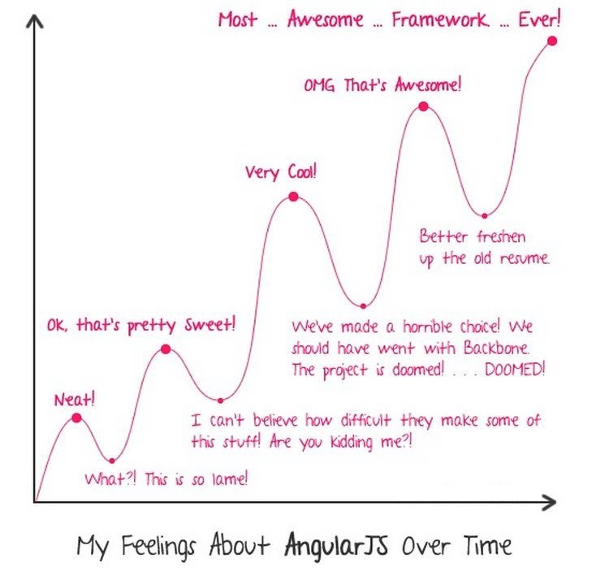

#Angular工厂模式

[Demo](http://unclexiao.github.io/angular-provider/)
回顾往期讲解的特性：

* MVC模式
* 双向绑定
* 依赖注入

本期介绍工厂模式
* $anchorScrollProvider
* $animateProvider
* $compileProvider
* $controllerProvider
* $filterProvider
* $httpProvider
* $interpolateProvider
* $logProvider
* $rootScopeProvider
* $sceProvider
